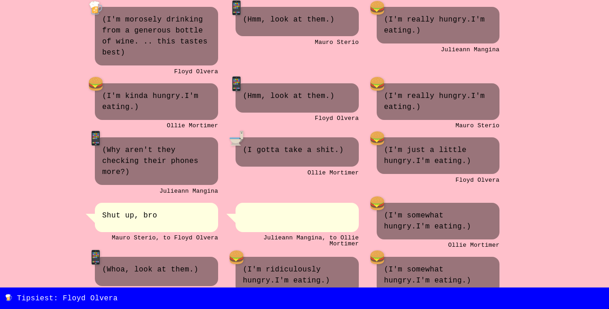

# Setup

```
npm install -d
npm start
```

Then visit `localhost:8081`



# Customizing content

- To edit the actions an agent can take, edit `sim/main/ACTIONS.js`
- To edit the personality quiz questions, edit `sim/quiz/QUESTIONS.js`
- To edit the dialogue, edit `sim/main/Dialogue/GRAMMAR.js`
- To edit the leaderboard stats, edit `sim/main/RANKINGS.js`

For more detail on customization, see below!

# Customization guide

## Adding a new action

Actions consist of:

- a name
- a timeout (how long the action lasts for)
- a successor function (defines how the action affects the agent's state)
- an emoji (to represent it in the front end)
- associated dialogue

First open `sim/main/ACTIONS.js`. Let's say we want to add a `dance` action. We can add the following:

```js
'dance': {
    timeout: TIME_RANGE,
    successor: function(action, state) {
        // agent is less bored after dancing
        state.boredom = Math.max(state.boredom-5*TIME_SCALE, 0);
    },
    emoji: '💃'
}
```

In the current version, the agent state variables you can change are:

- `bac` (blood alcohol level)
- `bladder`
- `hunger`
- `thirst`
- `boredom`
- `awkwardness`
- `sociability`

Now we just have to add some dialogue that the agent says/thinks when they're taking the action. Open `sim/main/Dialogue/GRAMMAR.js`.

To define the dialogue for an action, add a key to the dictionary that matches the action's name. That key should map to an array of dialogue options.

For example:

```js
'dance': ['I want to dance!', 'Oh this is my song!']
```

You can also include variables that are expanded into different texts. For example, we have one called `kinda-really` which randomly expands into either "kinda", "really" "maybe", "just a little", and so on.

For example:

```js
'dance': ['I #kinda-really# want to dance!', 'Oh this is my song!']
```

If the first option is chosen, it could end up as "I kinda want to dance!", or "I really want to dance!", and so on.

That's it!

## Adding a new leaderboard stat

A leaderboard stat consists of:

- a `rank` function, which defines how agents are scored from their action history (e.g. by number of drinks had). This will return a min and a max (e.g. person who drank the least and person who drank the most).
- a `desc` function, which takes the results (the min and max agents) and returns a string to present the result

You can see examples in `sim/main/RANKINGS.js`.

For example, here's a ranking for the person who drinks the most:

```js
{
  rank: h => {
    // count how many past actions were `drink_alcohol`
    return _.where(h, {name: 'drink_alcohol'}).length;
  },

  // show the agent who drank the most
  desc: r => `${ACTIONS['drink_alcohol'].emoji} Tipsiest: ${r.max.id}`
}
```
